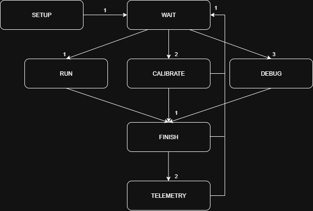

# Bally Software - Robô ESP32S3

Este projeto implementa o controle de um robô baseado em ESP32-S3, utilizando arquitetura orientada a objetos, FreeRTOS, comunicação ESP-NOW e execução paralela em dois núcleos.

> **Compatibilidade:**
> Este software está sendo desenvolvido para ser totalmente compatível com o hardware documentado no repositório [bally_robot](https://github.com/AlisonTristao/bally_robot).

#### Telemetria com T-Dongle S3 (LilyGO)
Para realizar a telemetria via ESP-NOW, é utilizado o T-Dongle S3 da LilyGO como receptor dos dados. O código desenvolvido para enviar comandos e logs do robô para o dongle está disponível em: [t_dongle_develop](https://github.com/AlisonTristao/t_dongle_develop).


## Estrutura do Projeto

```
├── include/         # Cabeçalhos e definições globais (pinos, tipos, wrappers)
├── lib/             # Bibliotecas principais (sensores, controle, motores, logger, etc)
├── robot/           # Implementação dos estados da máquina de estados
├── src/             # Código principal (main.cpp)
├── utils/           # Objetos estáticos e utilitários globais
├── platformio.ini   # Configuração do PlatformIO
```

### Principais Módulos

- **ArraySensor**: Gerencia o array de sensores frontais, incluindo calibração, leitura e normalização dos valores.
- **Control**: Implementa algoritmos de controle (PID, PD, PI, etc) para o robô.
- **Encoder**: Gerencia leitura dos encoders usando periféricos de hardware do ESP32.
- **HBridge**: Controle dos motores via ponte H, incluindo direção e PWM.
- **Logger**: Sistema de logs e comandos, com envio via ESP-NOW ou serial.
- **StateMachine**: Máquina de estados do robô, com transições e callbacks configuráveis.
- **StaticObjects**: Inicializa e centraliza instâncias globais dos principais objetos (robô, sensores, motores, logger, etc).
- **TinyShell**: Interpreta comandos recebidos em texto e executa funções configuradas.

### Outras Pastas
- **robot/**: Implementação dos estados (Setup, Wait, Calibrate, Debug, Run, Finish, Telemetry, Error).
- **include/**: Definições de pinos, tipos compartilhados, wrappers e headers globais.
- **utils/**: Contém as configurações globais das funcionalidades do robô, centralizadas no objeto `ROBOT`, que permite criar apenas uma instância. Esse objeto unifica o acesso aos sensores, motores, utilidades dos sensores, logger, controle e demais recursos.


## Fluxo Detalhado do Sistema

O funcionamento do robô é dividido em duas partes principais, aproveitando os dois núcleos do ESP32-S3:

### Setup (Configuração Inicial)
No início da execução (função `setup`), o sistema realiza:
- Configuração dos pinos e sentidos de operação (entradas/saídas, PWM, etc)
- Inicialização da máquina de estados
- Inicialização da comunicação ESP-NOW
- Conexão das funções de callback entre as bibliotecas (logger, máquina de estados, etc)

### Núcleo 1 (Core 1) — Execução Prioritária
O `void loop` roda exclusivamente no núcleo 1, especializado em executar a função principal de cada estado da máquina de estados. Isso garante que as funções críticas do robô tenham prioridade máxima, sem dividir processamento com tarefas paralelas.

### Núcleo 0 (Core 0) — Processamento Paralelo
No segundo núcleo, é executada a rotina paralela do robô, responsável por:
- Verificar as flags dos botões, sensores laterais, sinais PWM e LEDs
- Gerir as transições da máquina de estados, de acordo com as flags
- Gerenciar a fila de comandos recebidos por ESP-NOW
- Quando um pacote é recebido por ESP-NOW, ele é adicionado a uma fila; o processamento paralelo identifica o recebimento e executa o comando correspondente no TinyShell

---


### Comunicação
- **ESP-NOW:** Utilizado para comunicação sem fio entre robôs/controladores, envio de logs e comandos.
- **Serial:** Usado para debug local e fallback caso ESP-NOW não esteja disponível.


#### Logger (Telemetria e Debug)
Para criar uma maneira robusta de debug e envio de mensagens de telemetria usando ESP-NOW, o projeto utiliza uma biblioteca própria de logger:

- As mensagens de log são salvas em RAM, em um array cíclico.
- Cada log é uma struct que contém:
  - O tempo em milissegundos em que a mensagem foi adicionada
  - O tipo da mensagem (INFO, ERROR, CMD, TELEMETRY, etc), permitindo filtragem e priorização (por exemplo, utilizando o macro de ifndef, podemos desativar os logs e melhorar a eficiência do código)
  - O número do pacote, caso o conteúdo da mensagem ultrapasse o limite de 250 bytes do ESP-NOW (mensagens grandes são fragmentadas)
- Ao utilizar o método `logger_live`, os logs são enviados em tempo real para o endereço MAC definido, via ESP-NOW.
- Caso o ESP-NOW não consiga inicializar, ou para debug local, é possível redirecionar os logs para a porta serial, alterando a função de callback no `setup`.


### Flags (Eventos Temporizados e Segurança)
O projeto utiliza uma biblioteca de flags para facilitar a gestão de eventos temporizados e garantir segurança no controle dos atuadores:

- É possível definir um valor booleano (HIGH ou LOW) para cada flag, válido por um tempo determinado.
- No núcleo secundário, o sistema verifica periodicamente o tempo de cada flag e reseta automaticamente aquelas que expiraram.
- Isso permite notificar eventos disparados em interrupções (como botões ou sensores) de forma global.
- Para sinais de saída (output), também utilizamos flags: quando uma função deixa de enviar o sinal, a flag é desativada automaticamente, evitando que atuadores (motores, LEDs, etc) fiquem ligados por tempo indeterminado.

### Máquina de Estados
O robô é controlado por uma máquina de estados robusta, com funcionamento definido em tempo de compilação:

- A máquina de estados possui um número fixo de estados, definidos em enumeração no código (ex: SETUP, WAIT, CALIBRATE, DEBUG, RUN, FINISH, TELEMETRY, ERROR).
- Cada estado possui:
	- Uma função principal (main) que é executada com prioridade máxima no loop principal (núcleo 1).
	- Uma função de verificação de transição, que avalia as condições (flags, sensores, comandos) para decidir se o estado deve mudar.
- Caso ocorra qualquer problema na gestão dos estados (ex: função não definida, erro de transição), a máquina de estados automaticamente coloca o sistema no estado ERROR e notifica o erro no logger, garantindo segurança e rastreabilidade.
- Tanto as funções principais quanto as de transição podem ser customizadas conforme a aplicação.


## Dependências externas

- [TinyShell](https://github.com/AlisonTristao/TinyShell) (adicionada via `lib_deps` no platformio.ini)

## Diagrama da Máquina de Estados



---
Projeto desenvolvido por Alison Tristão.
